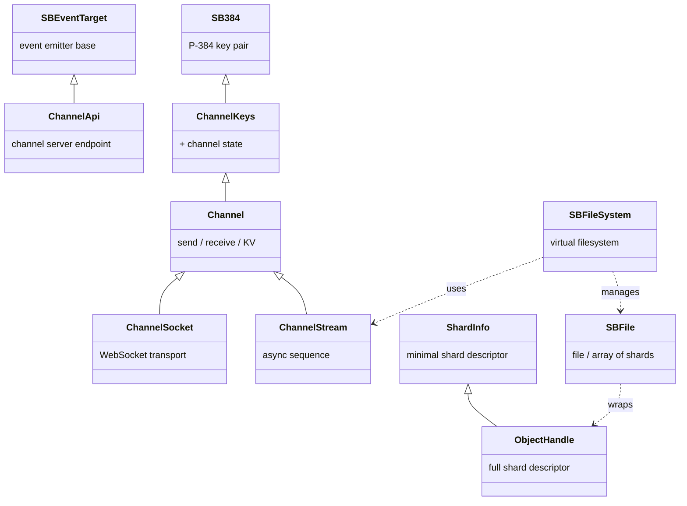

# lib384 API Reference

lib384 is the core runtime library for os384. It runs in any browser-native JavaScript environment (no Node, no npm), and provides everything an os384 app needs: key management, end-to-end encrypted channels, content-addressed shard storage, a virtual file system, and the app bootstrapping framework.

> Copyright (C) 2022–2026, 384, Inc. "384" and "os384" are registered trademarks.

---

## Class hierarchy

The main classes and their inheritance relationships (click any node to jump to its API page):



---

## Design principles

lib384 is built with the following explicit design goals:

- **No external dependencies** — the library has no third-party library dependencies
- **No DOM dependency** — runs in browsers, Cloudflare Workers, Deno, and any standards-compliant JS environment without requiring a DOM
- **TypeScript strict mode** — zero errors or warnings under `tsc --strict`
- **Minimal forced typecasting** — the type system reflects reality; `as` is treated as a code smell
- **DRY, abstract OOP** — designed to be subclassed and extended cleanly
- **The "ready" pattern** — async initialization is handled via the [ready template](/glossary#ready-template): objects can be constructed synchronously, with async readiness awaited separately; see [`SB384`](./sb384) for the canonical example

---

## Importing lib384

lib384 is distributed via an os384 channel page (it eats its own dogfood). The global loader at `384.dev` makes it available to every app automatically as `window.os384`. For direct use, import the ESM bundle:

```typescript
import * as lib384 from 'https://c3.384.dev/api/v2/page/<LIB_CHANNEL>/384.esm.js'
```

The channel address is environment-specific; see the `OS384_LIB384_ESM` env variable in your workspace config.

---

## Library version

```typescript
import { version } from 'lib384'
// e.g. "20250328.0"
```

---

## Quick reference

### Identity & keys

| Export | Kind | Description |
|---|---|---|
| [`SB384`](./sb384) | class | Core P-384 key-pair object. Foundation of all identities and channels. |
| [`ChannelKeys`](./sb384#channelkeys) | class | Extends `SB384`; adds channel connection state. |
| [`SBEventTarget`](./sb384#sbeventsource) | class | Static event emitter base class. |
| `SBUserPublicKey` | type | Base62-encoded P-384 public key string. |
| `SBUserPrivateKey` | type | Base62-encoded P-384 private key string. |
| `SB384Hash` | type | 43-character base62 SHA-384 hash. Used as `ChannelId` and `SBUserId`. |
| `ChannelId` | type | Alias of `SB384Hash`. |
| `SBUserId` | type | Alias of `SB384Hash`. |

### Channels

| Export | Kind | Description |
|---|---|---|
| [`ChannelApi`](./channel#channelapi) | class | Main entry point; represents a single channel server. |
| [`Channel`](./channel#channel) | class | Core channel object. Send/receive messages, read/write KV, manage history. |
| [`ChannelSocket`](./channel#channelsocket) | class | Extends `Channel` with WebSocket (low-latency) transport. |
| [`ChannelStream`](./channel#channelstream) | class | Extends `Channel`; async sequence interface for message history + live feed. |
| [`ChannelHandle`](./channel#channelhandle) | interface | Portable reference to a channel (key + optional metadata). |
| [`Message`](./channel#message) | interface | Decrypted, validated message as seen by application code. |
| [`MessageOptions`](./channel#messageoptions) | interface | Options for `send()` — TTL, routing, protocol override. |
| [`MessageTtl`](./channel#messagettl) | type | 0–15 TTL index (0=ephemeral, 15=permanent). |

### Storage & shards

| Export | Kind | Description |
|---|---|---|
| [`StorageApi`](./storage#storageapi) | class | Read/write shards to a storage server. |
| [`SBFile`](./storage#sbfile) | class | A file (or set of files) in os384. Wraps one or more shard handles. |
| [`ObjectHandle`](./storage#objecthandle) | interface | Fully describes a shard — id, key, iv, salt, verification, payload. |
| [`ShardInfo`](./storage#shardinfo) | interface | Minimal shard descriptor; base of `ObjectHandle`. |
| [`SBStorageToken`](./storage#sbstoragetoken) | interface | Storage budget token. |
| [`assemblePayload`](./storage#payload) | function | Encode arbitrary JS values to binary wire format. |
| [`extractPayload`](./storage#payload) | function | Decode binary wire format back to JS values. |

### Cryptography & protocols

| Export | Kind | Description |
|---|---|---|
| [`SBCrypto`](./crypto#sbcrypto) | class | P-384 / AES-GCM / PBKDF2 crypto utilities. |
| [`sbCrypto`](./crypto#sbcrypto) | const | Global singleton instance of `SBCrypto`. Use this, don't instantiate. |
| [`Protocol_ECDH`](./crypto#protocol-ecdh) | class | Default 1:1 public-key encryption protocol ("whisper"). |
| [`Protocol_AES_GCM_256`](./crypto#protocol-aes-gcm-256) | class | Shared passphrase symmetric encryption protocol. |
| [`generatePassPhrase`](./crypto#passphrase) | function | Generate a 3-word passphrase (14 bits/word, ~42 bits entropy). |
| [`generateStrongKey`](./crypto#passphrase) | function | Derive an AES key from a passphrase via PBKDF2 (10M iterations). |
| [`generateStrongPin`](./crypto#strongpin) | function | Generate a 4-char strong PIN (19 bits entropy). |
| [`generateStrongPin16`](./crypto#strongpin) | function | Generate a 16-char strong PIN (76 bits entropy). |

### Filesystem

| Export | Kind | Description |
|---|---|---|
| [`SBFileSystem`](./filesystem#sbfilesystem) | class | Browser-side virtual filesystem over channels + shards. |
| [`SBFileSystem2`](./filesystem#sbfilesystem2) | class | Deno/server-side variant of `SBFileSystem`. |
| [`BrowserFileHelper`](./filesystem#browserfilehelper) | class | Handles browser file input and drag-and-drop, producing `SBFile` arrays. |
| [`BrowserFileTable`](./filesystem#browserfiletable) | class | UI helper for rendering file lists. |
| [`browser`](./filesystem#browser-namespace) | const | Namespace bundling browser-specific helpers. |
| [`file`](./filesystem#file-namespace) | const | Namespace bundling filesystem classes. |

### App framework

| Export | Kind | Description |
|---|---|---|
| [`AppMain`](./appmain#appmain) | class | Bootstrap class for os384 apps. Loads manifest, sets up channels. |

### Utilities

| Export | Kind | Description |
|---|---|---|
| [`utils`](./utils#utils-namespace) | const | Namespace bundling encoding and buffer helpers. |
| [`AsyncSequence`](./utils#asyncsequence) | class | Composable async sequence with `map`, `filter`, `take`, `skip`, `zip`, etc. |
| [`Timeout`](./utils#timeout) | decorator | TypeScript method decorator for timeout + retry logic. |
| [`MessageType`](./utils#messagetype) | enum | Standard message type discriminant strings. |
| [`Base62Encoded`](./utils#encoding) | type | Branded string type for base62-encoded data. |

---

*lib384 source: `lib384/src/`. TypeScript types: `384.esm.d.ts`.*
