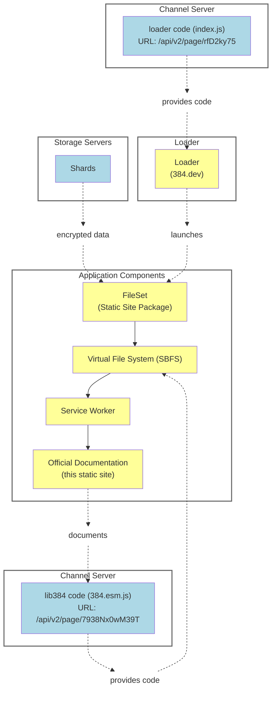

# A New Operating System

os384 allows you to write general purpose software that is genuinely private, secure, and and respects a user's sovereignty. That has simply not been possible before.

os384 runs partly on your devices, and partly on our servers – or on those of another vendor or your own servers. It's open source and not tied to any specific vendor.
Key management and in fact all user-related information
is handled client side, not by us or any other central authority.

Initial implementation of os384 is entirely in Typescript (ES2022).
A simple starting point as a developer is to look at
writing simple web apps. Key libraries are:

* lib384 code (ESM):
  https://c3.384.dev/api/v2/page/7938Nx0wM39T/384.esm.js

* lib384 types:
  https://c3.384.dev/api/v2/page/u2d23u7w/lib384.d.ts

* lib384 code (IIFE):
  https://c3.384.dev/api/v2/page/L2w00jf4/384.iife.js

Most documents related to 384 are actually distributed as PDFs hosted on os384,
or as "os384 apps" (including the "whitepaper" you are reading now).
These aren't "served" from 384.dev
in the conventional sense, instead, 384.dev will run what we call
the "loader" in your browser.

## The Loader

If you go to https://384.dev, you will see a screen like below. This
corresponds to "logging in", but is entirely local. It will ask for
a "[strongpin](/glossary#strongpin)" (essentially a username) and a passphrase. Or if you're
setting things up from scratch, you can provide a [storage token](/glossary#storage-token)
and create a new setup (or "[wallet](/glossary#wallet)") We'll go
into more details on all this later. For now, we're just going to
introduce the "loader" concept.

<figure style="text-align: center;" align="center">
  
  <figcaption>https://384.dev</figcaption>
</figure>

We will get back to the "top level" later. For now, try going to https://384.dev/#A1cQwk.
Click it, see what happens, and come back here.

You should have seen a PDF with a presentation about some aspects of the storage
system of os384, contrasted with other systems. But, crucially, our server had
no idea that this was a PDF. Note the URL, what's that "#A1cQwk" part?

Let's remind ourselves of what URLs are:

<figure style="text-align: center;" align="center">
  
  <figcaption>Levels of Sensitivity</figcaption>
</figure>

The diagram above illustrates the level of privacy leakage that occurs in common
use of the web. With a secured connection (the "S" in HTTPS), the only thing
leaked is the domain name. But the server itself of course sees the entire URL.

The "#A1cQwk" part is called a "fragment identifier" (or more technically a [URI fragment](https://en.wikipedia.org/wiki/URI_fragment)).
It's not transmitted over the network, it's just used by the browser, typically to navigate
to a specific part of the page. But it can also be used for sensitive information
such as keys or identifiers.

<!-- Alternative link formats: -->
<!-- 
- Simple markdown link: [Wikipedia: URI fragment](https://en.wikipedia.org/wiki/URI_fragment)
- Link with title attribute: [Wikipedia: URI fragment](https://en.wikipedia.org/wiki/URI_fragment "Learn about URI fragments")
- Link with icon: [ Wikipedia: URI fragment](https://en.wikipedia.org/wiki/URI_fragment)
- Link with emoji: [Wikipedia: URI fragment 🔗](https://en.wikipedia.org/wiki/URI_fragment)
-->

When you go to 384.dev, what happens is that your browser loads os384, more
specifically what we call "loader". It's essentially a microkernel, a
virtual machine manager (VMM), and a bootloader all in one.

The loader only runs inside your browser. It doesn't need to be served
from 384.dev, you can run it locally.

What the loader will do as it spins up depends on what URL you went to.
In the case of 384.dev/#A1cQwk, it will interpret "A1cQwk" as a shortened
name to a "Page", our equivalent of a url shortener. 

We won't cover Pages in detail yet, but they are associated with Channels,
and served with one of the api endpoints of Channels.

In this case, it will see that the page is a PDF, and that's a data format
that is safe to serve directly to the user.

For more complicated cases, with fully functioning web apps, they are not
safe to run at the "top level" of 384.dev, instead they are served from
a subdomain of 384.dev. The loader will pick a random subdomain, in order
to obscure from DNS or any other monitoring what the contents are.

These whitepapers are such a case. This diagram hopefully helps:

* The loader is served off 384.dev. The code for the loader itself
  is fetched from the "Page" api of a channel server.

* The loader sees a link to a [shard](/glossary#shard), which it fetches and interprets.
  In this case, it contains a [FileSet](/glossary#fileset) (this whitepaper).

* The loader launches a subdomain in a separate tab, and sets up
  a virtual file system. The code for this is also in lib384, which is
  also served as a Page.

* That virtual file system ([SBFS](/glossary#sbfs-os384-virtual-file-system)) sets up a [service worker](/glossary#service-worker), which
  will fetch, decrypt, and serve any components of the site
  (such as this html page)

* The "app" that's being served is the documentation that you
  would use to develop all the parts of the system.

