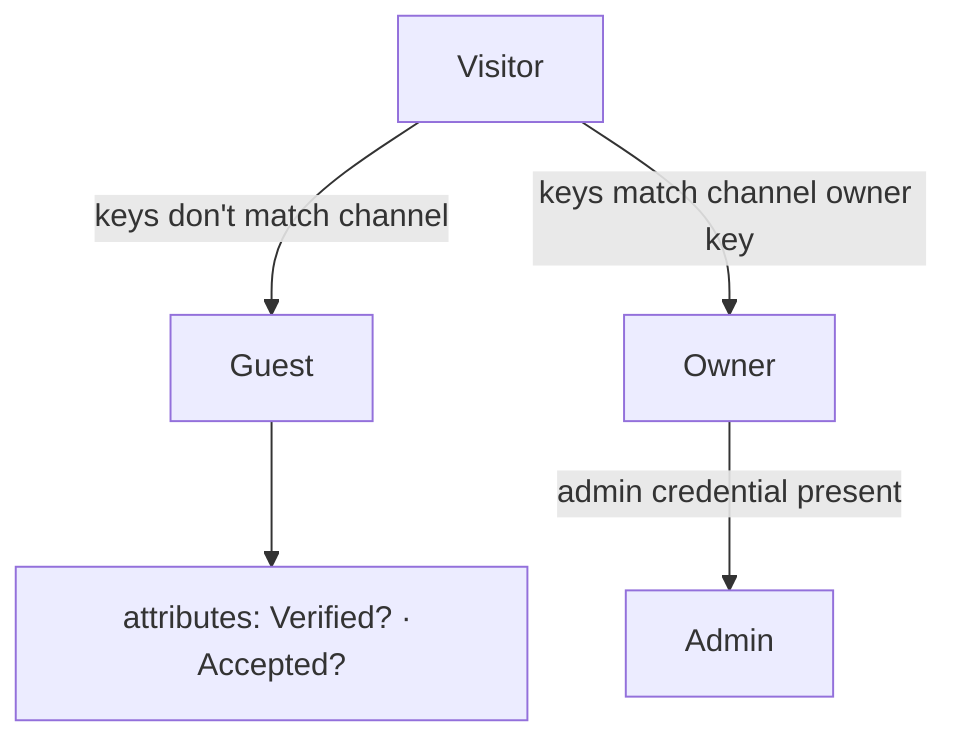
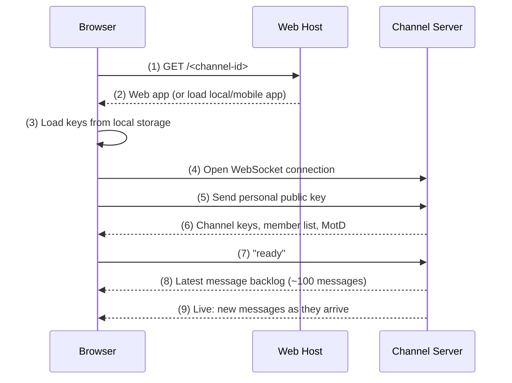

# Channels

Channels are the primary communication primitive in os384.
They provide secure, end-to-end encrypted communication between participants.

More formally, a channel consists of:

* A [**public/private keypair**](/glossary#public-key-pair).  The private key is known only to the channel's *owner*, the user who created and manages the channel.  The public key is used to validate messages and other important channel data signed by the owner.
* A [**channel ID**](/glossary#channel-id), a compact identifier for the channel, computed as the cryptographic hash of the channel's public key
* A set of public keys for the **non-owner members** ("[visitors](/glossary#visitor)") in the channel
* The channel's **message history**, a list of all [messages](/messages) sent in the channel, stored and retrievable in chronologically sorted order
* The channel's [storage token](/storage-tokens), which authorizes the channel to store messages on the channel server
* Other **channel state** information, such as the channel's *capacity*, the maximum number of users that can be added to the channel

A channel can be hosted on a [channel server](/channel-server), where clients can interact with the channel through the [channel API](/channel-api).
Note, however, that there is nothing in the definition of the channel that permanently binds it to a particular server.
This is by design: the channel owner is free to export all channel data and, with some work to
coordinate with other members of the channel, move to a new host at any time.

## Creating a Channel

To create a new channel, a client first generates a new public/private keypair for the channel.
Then the client sends the new public key to the server, together with a source of [storage budget](/glossary#storage-budget) such as a [storage token](/glossary#storage-token) or another channel, and requests that the server begin hosting the channel.
This initial request is signed with the new private key for the channel.

The server validates the storage token and verifies that it carries at least the minimum storage budget for a new channel.
If successful, the server adds the new channel to its set of channels and begins responding to channel API requests for the given channel. 

## End-to-end Encryption

Channels support pluggable modules for [E2E encryption](/glossary#e2e-encryption-end-to-end-encryption).
A single channel can use multiple different E2EE protocols simultaneously for different messages.
os384 provides two basic E2EE protocols for applications to use, but app developers are also free
to add their own.

## Special Channels

Channels can be used for sending messages to others, or for saving information for future use only by oneself.

One special kind of channel is the [Wallet](/wallet), a channel used for securely storing cryptographic keys and other secrets.
Unlike other channels, the wallet's private key is securely derived from key material that the user can easily write down
and/or commit to memory.
The Wallet functions like a sovereign, private, open source version of Apple's [iCould Keychain](https://support.apple.com/guide/security/icloud-keychain-security-overview-sec1c89c6f3b/web)
that can be used by any app to protect its users' secrets.

## Channel Server Basics

The most important concept in os384 is the "channel". It doesn't have a direct equivalence in any other operating system design but borrows from many. It is a of number of things, including an identity, a communication port, a ledger, a key-value store, and a "checking account" for [storage budget](/glossary#storage-budget) and API expenditure.

But at its heart is the identity. So we begin by saying a few things about the general troubles with identities.

<FigureRef id="channel-identifier-challenge" /> summarizes the main issue, namely, if there is any notion of a global identifier that's attributable to the end-user, then there is no strong assurance of privacy. Traditionally, systems track per-user data to manage necessary tasks such as permissions, cost allocations, etc. Not only does this leave a lot of target information on such servers, but a lot of this information "leaks" directly or indirectly by the way the web works.
  
<Figure id="channel-identifier-challenge" caption="Illustrates the challenge with identifiers in any sort of communication; in the illustration, we use people as the parties, but the same applies to programs or computers acting on behalf of users." src="/images/channels_10a.jpg" align="center" width="90%" />

<Figure id="channel-identifier-solution" caption="Shows how os384 approaches identity to maintain privacy and security." src="/images/channels_10b.jpg" align="center" width="90%" />

<Figure id="channel-connection-info" caption="Shows all the information needed to connect to a Channel (in addition to knowing what servers to try)." src="/images/channels_11.jpg" align="center" width="90%" />

os384 addresses this by using end-to-end identification and encryption at all points, with a primitive called "Channel". <FigureRef id="channel-connection-info" /> shows all the information needed to "connect" to a channel. This means all communication is point-to-point.[^1]

A channel begins as a public key that's generated by its owner and where the private part never leaves the client.[^2]

From the public key, the channel ID is generated using a hash, meaning, that every channel name is associated with a (secret) private key.

Channel servers never know this private key. A channel is created locally by simply generating a new key pair, and it is "registered" (or "authorized") with a channel server (with associated payment policy). That channel server will then respond to any connections to that channel – in accordance with any policies that the owner of the channel has determined, such as if only pre-approved users (endpoints) are allowed to connect.

All communication on a channel is both encrypted and signed, using a flexible protocol architecture.

As noted, Channels serve multiple roles in os384, one of which is that they function as "mutable" storage in a log (journal) format – all messages are stored, see <FigureRef id="channel-communication" />.
  
<Figure id="channel-communication" caption="Gives a simplified view of communication on a channel. Any messages sent are encrypted and indexed/keyed by the name of the channel and the timestamp. The timestamp is represented in Base4, and every message on a channel is guaranteed by the server to have a unique timestamp. Thus, every message ever sent has a global name. To fetch messages, you can for example query with that name." src="/images/channels_12.jpg" align="center" width="90%" />

The data structures that underpin channels are highly scalable. Any individual channel can receive and retransmit up to 1000 messages per second, up to 32 KiB each, and as long as there is budget, there is no practical limit to number of archived messages.[^3]

By this design, a channel can function as a repository for essentially any data structure, such as file systems or databases. If some part of the information is small, it is stored as a "message" (or "entry" or "value") on a channel, and if it's large, it is first stored as a [Shard](/glossary#shard) and the Object stored in a message.

Channel messages can of course contain objects (references to shards), and conversely, channels themselves can be "rolled up" back into shards (called "[deep history](/glossary#deep-history)").

Thus channels and shards blend mutable with immutable underpinnings, and we can thusly store and manage any sort of information.

## Core Identity Principles

Three properties follow directly from this design and are worth stating explicitly, because they differ from almost every other communication system:

- **No global user identity.** Your identity is always relative to a specific channel. The same person appears as a different cryptographic identity in every channel they participate in — there is no account, username, or identifier that links your participation across channels.
- **Channels are independent of servers.** A channel is defined entirely by its keys and its message history. The server is a host, not an authority. An owner can export all channel data and reconstitute the channel on a different server.
- **The only authentication is cryptographic.** There are no passwords. Proving ownership of a channel means proving possession of the corresponding private key — nothing else.

## Participants and Roles

Every person connecting to a channel is a *visitor*. Visitors fall into two categories depending on their keys:

A **Guest** is any visitor who is not the channel owner. Guests can be *verified* (their key is known to the channel) and *accepted* (explicitly approved by the Owner in a restricted channel). An **Owner** is the holder of the channel's private key — the key the channel ID was derived from. An **Admin** is an Owner who has additionally presented a valid admin credential, which enables channel management operations such as restricting the channel or setting the MotD.

## Connecting to a Channel

Here is the connection flow when a client joins an existing channel:

Step (1) is optional — if you are running the client locally or using a mobile app, the process begins at step (3). Step (3) checks local storage for any previously established keys for this channel; if none exist, a new participant key pair is generated. Step (6) returns the public keys of all other participants, allowing the client to verify and decrypt their messages. The channel only begins forwarding live traffic after the client confirms "ready" in step (7).

## Message Signing and Whispers

All non-private messages on a channel are **signed** by the sender. Signing uses an HMAC key derived from the sender's participant private key and the channel's signing key. If a received message fails signature verification, it is displayed with a visual warning. Signing ensures that no participant — and no server — can silently forge or alter a message attributed to someone else.

**Whispers** are private messages between just the Owner and one other participant, initiated from either side. For all other participants, the message appears as *(whispered)* without its contents. A whisper is encrypted using a key derived from the sender's private key and the recipient's public key, so the channel server never has access to the plaintext. Because whispers are encrypted point-to-point, they do not require a separate signature.

## Restricted Channels and Key Rotation

By default, any visitor with the channel ID can connect. An Owner can **restrict** the channel, after which only explicitly accepted participants can read messages. When restriction is applied, a new encryption key is generated and distributed only to accepted members. New visitors can request access; the Owner reviews and accepts (or declines) each request.

**Key rotation** (also called *locking* the channel) goes further: the Owner generates a completely new key pair locally, signs the new public key with the current owner key to establish a cryptographic chain of trust, and publishes the new public key. From that point on, only commands signed by the new owner key are accepted by clients and servers. Crucially, once rotation occurs, the identity of who is Owner becomes **immutable** — it cannot be reassigned without breaking the chain of trust. This is a feature: it means the history of ownership is independently verifiable by any participant.

A channel that is both restricted and has had its keys rotated is fully owner-controlled: no server, including the origin server, retains the ability to read messages or impersonate the owner.

::: info Building a chat app on channels
In the same spirit as classic Unix tools that communicate over plain text and ports, you can build a basic p2p or group messaging app directly on raw channels — the primitive is expressive enough to support it out of the box.

However, a production-quality chat application generally wants several additional layers on top: forward secrecy via message ratcheting, a contact list with a distributed trust model that works without a central authority, and UI-level key management that doesn't expose cryptographic details to end users. os384 has a chat application that provides these things, but it hasn't been migrated to the current platform yet. Watch this space.
:::

[^1]: This is not quite the same as peer-to-peer (p2p). Channels can accommodate p2p, but default is "mediated" communication, meaning, relayed by an edge server.

[^2]: This creates a challenge in "key management", which we will return to in a later section.

[^3]: Optionally, messages can be sent with a [time to live ("TTL")](/glossary#ttl-time-to-live) for lower cost and automatic cleanup. "TTL0" is a special type of TTL which the servers treat as "short lived", suitable for example for various protocols like WebRTC.
