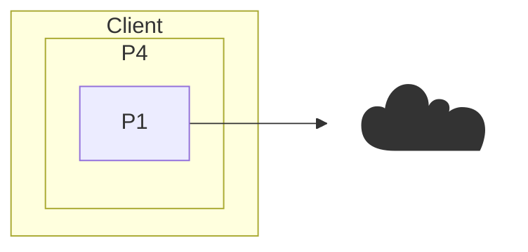

# os384 Overview

## Applications

An os384 application is a web app that runs in the user's browser, launched by the Loader.
Apps live on **channel pages** — content addressed and served from an os384 channel.
To open an app, a user follows a link like `https://384.dev/#<channel-key>`,
where the fragment (never transmitted to any server) tells the Loader which channel page to load.

The [Loader](/loader.html) is a special application that manages the user's [Wallet](/wallet.html)
and launches other applications, providing them with access to their channels and keys.
It plays a role similar to that of a Unix shell, Explorer.exe on Windows, or the Launcher program on Android.

## Channels

[Channels](/channels.html) are the primary communication primitive in os384. They provide secure, end-to-end encrypted communication between participants.
Each channel is identified by a public key, or sometimes by the hash of the public key.
The user who has the private half of channel's public key is called the *[channel owner](/glossary#owner)*.
The channel owner has full authority over the channel, and can control who may join the channel, etc.
Other members in the channel are identified only by their public key.
Thus, the full membership list for the channel consists of the owner public key and the public keys of any other non-owner ("[visitor](/glossary#visitor)") members.

An os384 application may be connected to several channels at once.
For example, when you use a chat app it might create one private "ledger" channel solely for its own use,
where it can store configuration data and information on all of its other channels.
Then it might have one (or more) channels for each of your chat conversations, where it sends and receives
chat messages with your friends.

The [**Channel Server**](/glossary#channel-server) implements the backend of the channel API to communicate with clients.
It provides endpoints for channel members to send and receive messages and for the channel owner to manage the state of the channel.
The channel server stores messages and channel state in an **Ordered Key/Value Store**.

### Special Channels
A [Wallet](/wallet.html) is a special kind of channel used to store cryptographic keys and other secrets.
Its private key is computed securely from key material that the user can write down or memorize.

### Messages

Clients communicate with each other by sending [messages](/messages.html) in channels.

Every message is encrypted with [AES-256-GCM](/glossary#aes-256-gcm), using a key derived by an [E2E encryption](/glossary#e2e-encryption-end-to-end-encryption) protocol specified by the channel.
The encrypted message is also signed by its sender.

The unencrypted plaintext contents of a message are encoded in a compact binary serialization format with features similar to JSON,
so messages may contain virtually any data, with a maximum size of 65kB.
Formatting and interpretation of message contents must be performed entirely by the client-side application before encryption and after decryption,
as the server can only see the encrypted payload, the cryptographic signature, the sender's timestamp for the message, and the sender's public key.

## Shards

[Shards](/shards.html) are the fundamental unit of data in os384. A shard combines content addressing together with encryption to create a secure, shareable reference to a blob of data.

The [**Storage Server**](/glossary#storage-server) implements the backend of the storage API to communicate with clients.
It provides endpoints for authorized users to store and retrieve shards of encrypted data.
Behind the scenes, the storage server stores its shards in an **Object Store**, sometimes called a "blob store".

## Internal Services

The channel server and the storage server are built on top of three core internal services,
outlined here for completeness and because it is critical for achieving the scale,
performance, and reliability required in a modern server platform.

The **Compute Service** provides the compute nodes that execute the server-side programs for the
channel server and the storage server.

The **Ordered Key/Value Store** stores messages and state for the channel server.

The **Object Store** stores shards for the storage server.

Our open source prototype development instance builds on services from Cloudflare.

## Base Infrastructure

The three core internal services run on top of a base infrastructure layer.
It uses distributed hash tables, consensus protocols, and other standard techniques to
map the core services onto a set of commodity hardware nodes to provide load balancing,
redundancy, and failover.

We currently use Cloudflare's base infrastructure as a result of building on their core services,
but commodity cloud platforms from Amazon, Google, Microsoft, and others all provide
similar facilities.
Those who wish to run their own infrastructure can use "cloud native" tools from the open source community.

### Client-side Computing

Whereas conventionally the 'platform' layer resides on servers, the os384 architecture migrates most platform functions into the client (browser).
It still talks to servers, somewhere, but entirely without any notion of a centralized authority.

Note that this design rectifies the original limitation of web application services that led to Big Tech consolidation in the first place.
Namely, that server applications were too complex, with too many dependencies and too much attack surface.
Operating those services effectively on a hostile Internet was prohibitively expensive because it required constant toil by skilled IT staff.
In contrast, 384 backed services are extremely lean and simple, with minimal dependencies and little attack surface.

### Backend Services

A complete 384 backed consists of only two services, the *channel server* and the *storage server*.
These in turn require only an ordered key-value store and an object ("blob") store.

The code for these two services is small enough that it can be audited for security or re-implemented in a different language by a small team.
Excluding library code, the channel server consists of fewer than 2500 lines of Typescript, and the storage server is even smaller with under 500 lines.
For comparison, servers for the Matrix encrypted chat protocol are much more complex and heavyweight, with typically over a hundred thousand lines of code in a high-level language.

The 384 backend services are a natural fit for modern commodity clouds including so-called "serverless" platforms such as Cloudflare Workers.
(In fact, our development prototype instance currently runs on Cloudflare.)
The strategy here is simple:
Use the public commodity cloud platforms for the things they are good at - building data centers, purchasing compute servers, replacing failed hard disks, minimizing costs, etc - but do not let them read your messages or look at your family photos.

At the same time, the 384 backend services are also easy to run stand-alone on a traditional server.
To make this even simpler, we provide a single Docker image that packages both the channel server and the storage server in one container.

Regardless of where the backend services are deployed, the 384 HTTP API is designed to make load balancing easy for horizontal scalability.

## Development

Source for all os384 components lives at [github.com/os384](https://github.com/os384).