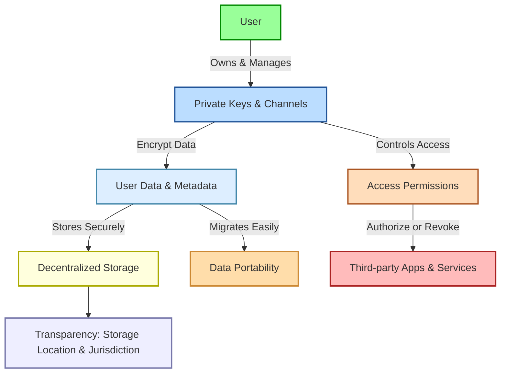

# Sovereign Computing

Traditional discussions about data sovereignty usually revolve around laws, national borders, and governmental oversight. But 384 envisions something deeper—empowering people themselves to reclaim true sovereignty over their digital lives, enabled through thoughtful architecture and advanced technical principles. It's not merely a legal or theoretical issue; it's about individual empowerment, transparency, and personal freedom in a digital age that increasingly compromises all three.

## Core Principles of Data Sovereignty

For 384, data sovereignty isn't an abstract concept—it's a tangible right and capability built directly into the technology. Users gain full control over their data, metadata, access rights, storage choices, and the laws governing their information. This redefinition is anchored in three core values: control, transparency, and personal freedom.

Here's how these values unfold in practice:

- **User-Centric Control**:  
  384 puts the power firmly in the hands of users. Instead of relying on centralized gatekeepers, users themselves determine precisely who can access their information, when, and how. Key management features embedded in 384's design provide meaningful autonomy.

- **Complete Transparency**:  
  Users deserve clarity about where their data lives, how it's processed, and under which jurisdiction it falls. While 384's own services typically operate within US jurisdiction, the architecture permits users to independently host their data elsewhere, according to their own preferences and requirements.

- **Freedom to Move and Change**:  
  Data portability is crucial—users should never feel trapped. 384 facilitates easy migration and revocation of permissions, with an architecture based on independent "channels" that travel with users rather than tying them down to any one platform or provider.

- **Digital Self-Ownership**:  
  384's core philosophy recognizes digital data as an extension of personal property rights. Users should never have their data commoditized without consent or used for unwanted commercial gain.

- **Technical Empowerment**:  
  Beyond simply promising privacy, 384 provides robust, open-source technology enabling developers and users alike to create and utilize services that respect data sovereignty inherently—without relying on the goodwill of centralized providers.

## Data Sovereignty Architecture

The following diagram illustrates how 384's approach to data sovereignty works in practice, highlighting the user-centric flow of control:

## Technical Implementation and Advantages

Where typical approaches to data sovereignty emphasize national jurisdiction and governmental oversight, 384 reshapes the concept around technical empowerment of the individual. The differences are clear:

- **Action Beyond Legal Rights**:  
  Traditional legal protections often lag far behind reality, leaving users exposed. Instead of waiting for slow or absent legal remedies, 384's architecture proactively safeguards data through technology itself.

- **Decentralization vs. Centralization**:  
  Historically, trusting centralized entities was necessary, even if risky. 384 challenges this norm by utilizing decentralized architectures—reducing trust dependence on single points of failure or abuse.

- **Privacy and Identity Management**:  
  Many existing services rely on personal identifiers like phone numbers and emails, compromising privacy. 384 avoids such identifiers, instead generating unique per-channel public keys locally on user devices to mitigate surveillance and tracking.

- **True End-to-End Encryption**:  
  Most services advertising "end-to-end encryption" still require trusting servers for key management. 384 flips this by empowering users with genuine ownership and control over their keys, reducing server-side vulnerabilities.

- **Open Source, Open Possibilities**:  
  Proprietary software often hides critical functions, risking vendor lock-in. 384 instead chooses an open-source model (AGPLv3 or similar licenses), enabling transparency, collaboration, independent verification, and robust community-driven development. Interoperability is fundamental, freeing users from single-vendor ecosystems.

## Practical Significance and Impact

384's vision for data sovereignty isn't just philosophically appealing—it's practically vital. Here's why:

- **Personal Freedoms at Stake**:  
  Control over personal data directly shapes autonomy. Without sovereignty, individuals risk exploitation, manipulation, and surveillance.

- **Strengthening Security and Privacy**:  
  Minimizing dependence on central authorities inherently boosts security and reduces vulnerabilities, protecting against breaches and misuse.

- **Building Trust and Accountability**:  
  True control and transparency rebuild users' trust in digital services, promoting a more accountable digital landscape.

- **Encouraging Innovation and Competition**:  
  When data sovereignty is foundational, innovation thrives. Developers can create genuinely user-centric solutions, challenging dominant data-extractive models.

- **Resilience Against Censorship and De-platforming**:  
  Users can easily migrate their data and communication channels away from platforms that censor or disrupt their activities, protecting crucial connections and communications.

- **Meeting Demands of Security-Conscious Sectors**:  
  Sensitive fields like government contracting, freight fintech, and AI development require the enhanced protection and flexibility that 384's principles deliver.

## The Path Forward

384's take on data sovereignty shifts away from traditional legalistic frameworks towards meaningful technological empowerment of individuals. It offers more than just a vision—it proposes a practical, technical foundation enabling users to genuinely control their digital destiny. In a world increasingly governed by data, 384's approach offers a pathway towards security, privacy, freedom, and fairness—where digital sovereignty is not a distant aspiration, but an everyday reality. 

 

::: info Next: Architecture
Continue to the [Architecture](/architecture) section for a technical overview of how os384's
parts are structured and how they work together to deliver sovereign computing.
:::
