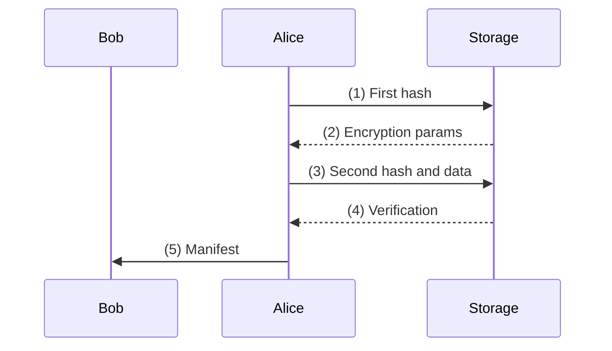

# Storage (Shard) Server Basics

Data storage in os384 is in the form of [padded](/glossary#padding), encrypted, immutable, "anonymous" blobs of data each restricted to a server-specified range of sizes.[^1]  Very large amounts of data thus needs to first be divided into one or more such chunks; we will cover that later. The final (at rest) storage is in the form of encrypted chunks called [Shards](/glossary#shard). Hence "[Storage Server](/glossary#storage-server)" is sometimes referred to as "Shard Server".

There is a process for accepting (ingesting) new data into the storage system, which is somewhat complex and also involves the [Channel Server](/glossary#channel-server), which we will get to below. First we look at the basics of what "storage at rest" looks like, in <FigureRef id="basic-storage" />.

Once accepted and stored, the Storage Server simply maintains a mapping of "ID" to the data. To read the data, a client would provide both the ID and the verification string. The server looks up the data, confirms the verification string, and returns the shard.[^2] 

This makes it trivial to implement a "read only" server, also called a "cache" or "mirror". The right side of <FigureRef id="basic-storage-mirror" /> shows how a mirror server might store shards in a simple directory on the local hard drive. On "the internet", it can be stored in various ways, and managed with respect to performance vs cost etc.

The "ID" of the data is a hash function of the data itself, as we will describe next. Thus, any identical piece of information will only be stored once, called "[de-duplication](/glossary#deduplication)". However, since we want to deduplicate data in a private manner, this requires a bit of finesse.
  
<Figure id="basic-storage" caption="Basic storage service. Any client need only retain the basic parts of an Object (refer to Figure 2). The server simply keeps blobs of data indexed by the shard ID, an associated verification string that is server-specific, and any additional cryptographic materials, in this case a nonce and a salt." src="/images/storage_06a.jpg" align="center" width="90%" />

<Figure id="basic-storage-mirror" caption="Storage mirror service implementation example, showing a simple directory structure for storing and retrieving shards." src="/images/storage_06b.jpg" align="center" width="90%" />

The diagram below shows the basic interchange with the storage server: Alice wants to send some data to Bob. At the core of the storage protocol, Alice collaborates with the storage server to derive an encryption key, then uploads that encrypted data, and sends the Object to Bob (labelled "[5] Manifest" in the figure).



<Figure id="storage-metadata" caption="Example of (minimum) metadata kept by storage server (per shard)" src="/images/storage_08.jpg" align="center" width="90%" />

<Figure id="shard-hexdump" caption="Sample hex dump of a shard." src="/images/storage_09.jpg" align="center" width="90%" />

Most existing online storage systems can only effectively deduplicate unencrypted data. This leads to significant cost increases. The reality is that "most" data that individuals and companies store are copies – consider a set of PDF documents that might be related to some real estate transaction: there will be multiple parties involved, that all have various subsets of the exact same files.

Deduplicating online storage of data under the constraints of security (encryption) and privacy (anonymization) has been the subject of many years of research, and a few basic approaches have been suggested, but at the time that we began work on os384, to our knowledge there were no working services.

Since this characteristic (secure, private, but the server-side can still deduplicate) is unusual, let's summarize our requirements on a modern "web3" storage system:

- The system should be highly secure and private.
- Data should be strongly encrypted. There should be no way for network or server to inspect contents.
- For any particular piece of data, it should be difficult to determine who first uploaded a copy.
- It should be difficult to determine who has downloaded copies.
- It should be very difficult to determine who "shares" (or "links") a copy, e.g., provided the necessary information that allowed a party to download.
- It must be possible to allocate the cost of storage, such that regardless of scale of the system, it does not rely on any particular user behavior (e.g. peer hosting).
- Any information about "traffic" related to uploads, downloads, etc., should be ephemeral.
- It should be difficult to determine if a piece of data exists on the system, e.g., if it has been uploaded.
- The system must be fundamentally capable of scalable deduplication of data.
- Names of chunks of data should be universal, and not tied to any particular server or source.
- It should be possible, and simple, for any individual host or server to block ("blacklist") any particular chunks of data, subject to their choice of hosting policies.
- Finally, the system shouldn't depend on any external sources of naming or authentication. In other words, clients should be able to validate any data regardless of trust of any other parties it communicates with.

Let's walk through how os384 accomplishes storage to match these requirements.

We will begin with a simple case, such as a small JPEG image, with no real need for additional information. A more complex case, such as backing up a large directory of files, will require other information to be handled – e.g. the list of files itself, for each file a list of one or more chunks and additional meta data like file names and last modified dates, etc. Beyond that, we can cover how things like "applications" are handled. The storage server per se is unaware of any of these "details". We will cover them later when we discuss the File System ("[SBFS](/glossary#sbfs-os384-virtual-file-system)").

For now, assume we just want to store a single piece of data, small enough to fit into a single shard:

1.	The client first packages any data to be saved into an ArrayBuffer.[^3]  From the perspective of an app developer, more or less any valid JavaScript object can be stored, as its first "package".[^4] 
2.	This data is next padded to prescribed lengths. The purpose is to reduce information leakage inherent in the size of, for example, underlying files.[^5] 
3.	The padded data is hashed with SHA-512 (producing 64 bytes), which is split into two 32-byte halves: h1 (the first half, used as the server-side lookup key) and h2 (the second half, used as the client-side encryption key material). The server never sees h2.
4.	Next the client sends the first hash to the storage server, see the sequence diagram above. In that diagram, Alice sends h1 ("[1]"), and then receives encryption parameters.
5.	The server keeps a separate table translating "h1" hashes to verification, 16-byte [salt](/glossary#salt), and 12-byte [nonce](/glossary#nonce) (also called "[iv](/glossary#iv-initialization-vector)"). Thus, every user who has the same piece of data "D", will be deriving the same "h1" and hence receiving the same verification, salt, and nonce.
6.	If a particular value of h1 has not been seen, the server will generate random values. The client can't see the difference between an old and a new match. Furthermore, the server has a "[privacy window](/glossary#privacy-window)" (currently set to 14 days), which resets this data for any given h1.
7.	The client then takes the second hash (h2) and the salt and 100,000 iterations of [PBKDF2](/glossary#pbkdf2-password-based-key-derivation-function-2) (with SHA-256) to derive an encryption key ([AES-GCM](/glossary#aes-256-gcm) length 256). Note: this is lower than the 10 million iterations used for wallet key derivation — h2 is already high-entropy hash material, not a human password, so fewer iterations are needed.
8.	Next the client encrypts the padded data with this key and the provided nonce ("iv").
9.	The client then takes the size of this encrypted buffer and obtains a "storage token" to match the size.[^6] 
10.	A SHA-256 hash is taken of the concatenation of (iv + salt + encrypted buffer). This is the final content address (storage ID) of the shard — a third hash, derived from the encrypted form, distinct from h1 and h2.
11.	The encrypted data can now be uploaded to the server – the client provides the final identifier, nonce, salt, storage token, and the data itself.
12.	The server now validates all the different parts: it confirms that the token is valid (and marks it "consumed"), and uses the nonce, salt, and data to verify the object identifier.[^7] 
13.	Once all validated, the server responds with success, and the [verification](/glossary#verification). The client needs to hold on to that value, since it demonstrates that this storage has been paid for.
The result of this protocol is the object in Figure 2. Everything else can be discarded. The data the server will return upon a future query will include the nonce and salt, so the client does not need to track that.

One important design property follows from the encryption scheme: the storage server can enforce a content policy — for example, responding to lawful takedown requests — by overwriting a shard. What it cannot do is pre-emptively scan or inspect the contents of any stored shard. The design deliberately preserves this distinction.

This covers the basics of the storage server. The next main building block is the Channel Server.

## Storage Budgets

Storage in os384 is not free-floating: every shard upload must be authorized by a **storage token**, a one-time-use spend credential. Tokens are issued by Channels out of their storage budget.

Each Channel holds a `storageLimit`, a byte count representing its current storage budget. This is persisted in the Channel's own Durable Object storage. When a client wants to upload data, it first requests a token from the channel:

```
GET /api/v2/channel/<id>/getStorageToken?size=<bytes>
```

The channel debits its `storageLimit` by the requested size and creates an `SBStorageToken`:

```ts
{
  hash: string,      // random unique token identifier
  size: number,      // approved byte count (after padding)
  motherChannel: ChannelId,
  created: number,   // timestamp
  used: false
}
```

The channel writes this record directly into a shared `LEDGER_NAMESPACE` KV store (accessible to both the Channel and Storage servers), then returns the token to the client.

The client includes the token's `hash` in its `storeData` request. The storage server looks up the token in `LEDGER_NAMESPACE`, then verifies: the token is not already used, the upload size exactly matches `token.size`, and the shard ID is consistent with the data. On success, the server marks `used: true` in `LEDGER_NAMESPACE` — the token is spent and cannot be reused.

There is no separate ledger process. The channel server is the ledger: it holds the budget, issues tokens, and the storage server validates against the same shared KV store.

### Bootstrap

On a personal or self-hosted server, storage budget can be inserted directly without going through a channel. A token can be written straight into `LEDGER_NAMESPACE` via the CLI:

```bash
wrangler kv:key put --binding=LEDGER_NAMESPACE \
  "<token-hash>" '{"used":false,"size":33554432}'
```

This creates a 32 MB spend token that any client with the hash can use to upload data. The CLI (`384`) provides a wrapper for this that handles key generation.

[^1]: Current server allows a range of 64 KiB to 4 MiB.
[^2]: An "Object" as introduced earlier (Figure 2) identifies a shard, but the (raw) data itself is the "Shard".
[^3]: In all our specific examples, we will use Typescript, which is the current system language used by OS384.
[^4]: Any JavaScript object that can be serialized (structured clone) can be stored. The library handles packaging into an ArrayBuffer automatically.
[^5]: Exactly how this is done does not matter too much; the purpose is to reduce the set of possible shards, in order to reduce the information leakage inherent in the shard size. The current policy is to round up to closest 4 KiB, after which round up to closest power of 2, doing so up to a size of 1 MiB, and after that round up to closest MiB boundary.
[^6]: This is handled by the Channel Server, and we will cover this in more detail below. Briefly: when you create a Channel, it will have a "budget", and one its abilities is to "print" storage tokens out of that budget.
[^7]: Note that the client does not need to use the same nonce and salt that the server provided in response to h1. It's free to generate its own random values. This is a subtle trade-off in privacy. The downside of using server-provided values is that if the server is compromised during the entire operation, it can be traced who "first" uploaded a piece of information. However, the downside of the client using its own random values is to remove deniability – now the object could only have come from that client. In normal operation, the server's privacy window obfuscates the point of upload from any future points of download.
